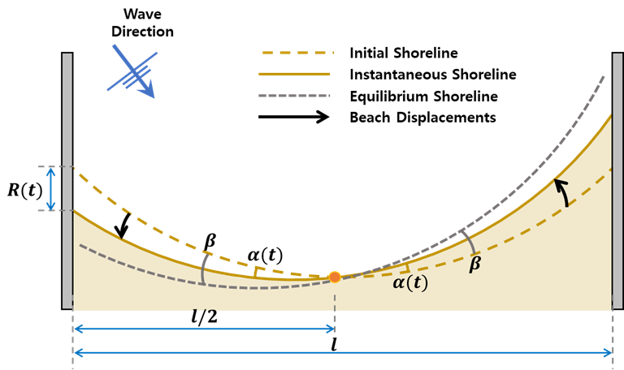

# Equilibrium-based shoreline evolution models (EBSEM) - Longshore 

## IHSetTurki (Turki et al., 2013)

Unlike previously introduced beach advance/retreat caused by the incoming wave energy, the shoreline rotation depends on the longshore sediment transport where wave directionality is paramount. Under the assumption that the instantaneous shoreline position depends on that of equilibrium, Turki et al. (2013) proposed a simple shoreline evolution model for predicting the shoreline rotation. This model is useful to understand the dynamics of the shoreline evolution caused by wave direction. In addition, this model simply predicts temporal evolution in beach rotation.

Turki et al. (2013) suggested a shoreline rotation model considering that the shoreline response rate can be expressed as proportional to the difference between the instantaneous position and the equilibrium rotation as follows (Fig. 2-4-1):

$$
\frac{∂R(t)}{∂t}=ω(R_∞-R(t))
$$

- $ω$ : the ratio of beach change which is proportional to the characteristic time scale $T_s$ ($ω=1/T_s$)
- $R_∞$ : the equilibrium shoreline response
- $R(t)$ : the instantaneous position at time $t$ 

$R_∞$ and $R(t)$ can be calculated geometrically as a function of the beach length l as below:

$$
R_∞=\frac{l}{2}tan⁡β
$$
$$
R(t)=\frac{l}{2}tan⁡(α(t))
$$

- $β$ : the angle between the initial shoreline position and the wave crest
- $α(t)$ : the shoreline rotation angle at time $t$

According to the volumetric change based on the alongshore sediment transport, the characteristic $T_s$ is calculated as follows:

$$
T_s(t)=\frac{l^2h^*(tan⁡β-tan⁡(α(t)))}{4KF_rx(β,R(t))}
$$

- $l$ : the beach length
- $K$ : the transport coefficient which is related to sediment characteristics such as sediment density $ρ_s$, water density $ρ_w$, gravity acceleration $g$, sediment porosity a and dimensionless proportionality coefficient $k$
- $F_r$ : the energy flux per unit required to move sediments 
- $h^*$ : the closure depth which is expressed as the function of the wave height $H_s$ ($h^*=C_cH_s^{0.67}$; where $C_c$ is a constant value that differs from one beach to another)
- $x(β,R(t))$ : the coefficient which is defined as follows:

$$
x(β,R(t))=sin⁡(2β)-\frac{4R(t)}{l}cos(2β)
$$

**Fig. 2-4-1. Definition sketch of shoreline rotation model proposed by Turki et al. (2013).**

## IHSetJaramillo21a (Jaramillo et al., 2021a)

Sever erosion can occur under storm waves with significant changes in wave, which makes the prediction of shoreline orientation very important. Jaramillo et al. (2021a) proposed an equilibrium-based shoreline rotation model which is a simple and efficient way to predict shoreline orientations. Based on previous research concepts and observation data, this model assumes that shoreline orientations depend on the incoming wave power and direction. 

Jaramillo et al. (2021a) suggested a shoreline rotation model that predicts the temporal evolution of the shoreline orientation based on the concept of previous research and the observation data as follows:

$$
\frac{∂α_s(t)}{∂t}=L^±P(α_s-α_{s,eq})
$$

- $P$ : the incoming wave power related to the significant wave height $H_s$ and the wave peak period $T_p$ as $P=H_s^2T_p$
- $α_{s,eq}$ : the asymptotical equilibrium shoreline orientation
- $α_s(t)$ : the shoreline orientation at time $t$
- $L^±$ : the proportional constants where $L^+$ indicates the clockwise shoreline rotation and $L^-$ indicates the counterclockwise rotation, respectively

Jaramillo et al. (2021a) suggested the linear relationship between the asymptotical equilibrium and the incident wave direction as follows: 

$$
α_{s,eq}=\frac{θ-b'}{a'}
$$

- $θ$ : the incident wave direction
- $a',b'$ : the empirical parameters that satisfy the linear relationship

**Fig. 2-4-2. Definition sketch of shoreline rotation model proposed by Jaramillo et al. (2021a).**