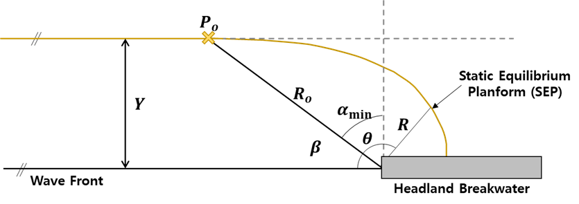

# Static equilibrium (Beach Planform)

## IHSetGonzalez (Hsu and Evans, 1989; Gonzalez and Medina, 2001)

Hsu and Evans (1989) proposed the Parabolic Bay Shape Equation (PBSE) to predict the static equilibrium beach planform. Nowadays, among similar models (Silvester and Ho, 1972; Yasso, 1965), the PBSE is the most widely used for coastal engineering and management. However, since this model is developed empirically, the PBSE has no independent theoretical support. In addition, it is not easy to predict the down-coast limit, which is one of the most important parameters in the PBSE. Therefore, González and Medina (2001) proposed a modified version of the PBSE based on the analytical current model. This model has the advantage of easily locating the down-coast limit of the bay.

Hsu and Evans (1989) proposed the PBSE to predict the static equilibrium planform as follows (Fig. 2-2-1):

$$
\frac{R}{R_o} =C_0+C_1(\frac{β}{θ})+C_2(\frac{β}{θ})^2
$$

- $R$ : the radius measured from the tip of the headland breakwater
- $R_o$ : the length of the control line joining the updrift diffraction point to the down-coast control point
- $θ$ : the angle between the location of $R$ on the shoreline 
- $β$ : the angle between the control line and the wavefront at the diffraction point
- $C_i$ : the calibration parameters that depend on the wave obliquity ($β$) based on measured shapes of the model beaches ($i$=0,1 and 2)

González and Medina (2001) proposed the methodology for estimating the location of the down-coast limit distance R_o from the control point as a function of $α_{min}(=90°-β)$ (Fig. 2-2-1):

$$
R_o=\frac{Y}{cos⁡(α_{min})}
$$

$$
α_{min}=tan^{-1}⁡[\frac{\frac{β_r^4}{16}+\frac{β_r^2}{2}\frac{Y}{L_s}}{\frac{Y}{L_s}}]
$$

- $Y$ : the distance from the control point to the straight alignment down-coast
- $L_s$ : the scaling wavelength calculated by the peak wave period and the wave depth at the diffraction point
- $β_r$ : the angular parameter with a calculated value of 2.13 obtained by comparing 26 Spanish beaches

**Fig. 2-2-1. Definition sketch of the static equilibrium planform proposed by González and Medina (2001).**
