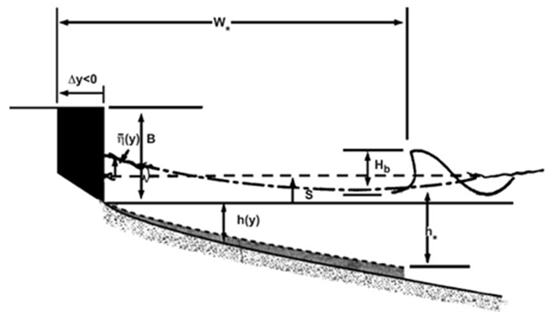

# Static equilibrium (Beach Profile)

## IHSetDean (Dean, 1991)

Dean (1991) have proposed the concept of an equilibrium beach profile. Dean (1991) derived the equilibrium beach profile model with the wave energy dissipation similar to other previous works (e.g., Bruun, 1954). The equilibrium beach profile equation is very simple, but has been used by many researchers for coastal engineering.

Dean (1991) suggested a simple equilibrium beach profile equation based on the wave energy dissipation as follows:

$$
h=Ay^{2/3}
$$

- $h$ : the water depth
- $y$ : the seaward distance
- $A$ : the Dean parameter

**Fig. 2-1-1. Definition sketch of equilibrium beach profile model (Dean, 1991).**

## IHSetBernabeu (Bernabeu et al., 2003)

Meso- and macro-tidal beaches, which constitute a large proportion of beaches in the world, are characterized by separated beach profiles. Many researchers, including Bruun (1954) and Dean (1991), have proposed the concept of an equilibrium beach profile. However, they considered the wave condition without tidal influence. Therefore, Bernabeu et al. (2003) proposed a two-section equilibrium beach profile model (2S-EBP) based on the concept of these previous studies. This model is useful for predicting the equilibrium beach profile under various conditions.

Bernabeu et al. (2003) proposed the 2S-EBP to predict the static beach profile for two separated sections (i.e., surf and shoaling profiles) as follows:

Surf profile:
$$
x = (\frac{h}{A})^{3/2} + \frac{B}{A^{3/2}}h^3 (0 ≤ x ≤ x_r)
$$
Shoaling profile:
$$
X = x - x_0 = (\frac{h}{C})^{3/2} + \frac{D}{C^{3/2}}h^3 (x_r ≤ x ≤ x_a)
$$

- $h$ : the water depth from the mean sea level
- $x$ : the cross-shore distance from the shoreline
- $A,B,C,D$ : the calibration parameters that depend on the energy dissipation (i.e., $A$ for the surf profile and $B$ for the shoaling profile) and the reflection process (i.e., $C$ for surf profile and $D$ for shoaling profile)
- $x_0$ : the cross-shore distance between the beginning of the surf profile and the virtual origin of the shoaling profile over the mean sea level. The cross-shore distance $x_0$ can be expressed as follows follows:

$$
x_0=(\frac{h_r}{A})^{3/2}-(\frac{h_r}{C})^{3/2}+\frac{B}{A^{3/2}}h_r^3-\frac{D}{C^{3/2}}  h_r^3
$$

Here, $h_r$ is the discontinuity point of water depth from the mean sea level.

**Fig. 2-1-2. Definition sketch of equilibrium beach profile model (Bernabeu et al, 2003).**
