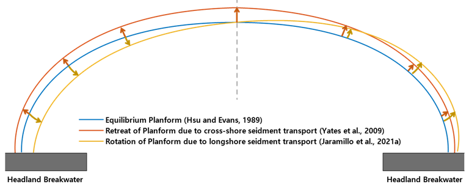

# Hybrid Models

## IHSetIH-MOOSE (Jaramillo et al., 2021b)

Shoreline evolution is a complex natural phenomenon involving longshore and cross-shore sediment transport, shoreline rotation, etc., which creates the need for hybrid models that simulate diverse situations. Jaramillo et al. (2021c) proposed a hybrid model for embayed beaches, IH-MOOSE (Model Of Shoreline Evolution), by integrating equilibrium-based cross-shore, planform, and rotation evolution models. In other words, IH-MOOSE combines the following models: (1) the equilibrium cross-shore evolution model (Yates et al., 2009), (2) the equilibrium planform model (Hsu and Evans, 1989), and (3) the equilibrium shoreline rotation model (Jaramillo et al., 2021b). With few calibration parameters required, IH-MOOSE is a reduced-complexity model compared to the other process-based models. This model performed well when applied for a long time-period on embayed beaches in New Zealand and Australia.

Jaramillo et al. (2021) proposed a hybrid shoreline evolution model based on cross-shore, planform and rotation equilibrium models. The hybrid models suggested by Jaramillo et al. (2021) can be expressed as follows:

**(1) Equilibrium cross-shore evolution model** (Yates et al., 2009; see [IHSetYates](ebsem_cross.md#ihsetyates-yates-et-al-2009)):

$$
\frac{∂S(t)}{∂t}=C^±E^{1/2}(E-E_{eq}(S))
$$

- $E$ : the incoming breaking wave energy related to the breaking wave height (water depth at breaking $h_b$ and breaking index γ) as $E=(\frac{H_b}{4.004})^2=(\frac{γ}{4.004})^2 h_b^2$
- $E_{eq}$ : the equilibrium wave energy corresponding to the current shoreline position
- $S(t)$ : the shoreline position at time $t$
- $S_{eq}$ : the equilibrium shoreline position
- $C^±$ : the free parameters where $C^+$ indicates the accretion and $C^-$ indicates the erosion, respectively

**(2) Equilibrium planform model** (Hsu and Evans, 1989; see [IHSetGonzalez](equilibrium_planform.md#ihsetgonzalez-hsu-and-evans-1989-gonzalez-and-medina-2001)):

$$
\frac{R}{R_o} =C_0+C_1(\frac{β}{θ})+C_2(\frac{β}{θ})^2
$$

- $R$ : the radius measured from the tip of the headland breakwater
- $R_o$ : the length of the control line joining the updrift diffraction point to the down-coast control point
- $θ$ : the angle between the location of $R$ on the shoreline 
- $β$ : the angle between the control line and the wavefront at the diffraction point
- $C_i$ : the calibration parameters that depend on the wave obliquity ($β$) based on measured shapes of the model beaches ($i$=0,1 and 2)

**(3) Equilibrium shoreline rotation model** (Jaramillo et al., 2021; see [IHSetJaramillo21a](ebsem_long.md#ihsetjaramillo21a-jaramillo-et-al-2021a))

Jaramillo et al. (2021) suggested a shoreline rotation model that predicts the temporal evolution of the shoreline orientation based on the concept of previous research and the observation data as follows:

$$
\frac{∂α_s(t)}{∂t}=L^±P(α_s-α_{s,eq})
$$

- $P$ : the incoming wave power related to the significant wave height $H_s$ and the wave peak period $T_p$ as $P=H_s^2T_p$
- $α_{s,eq}$ : the asymptotical equilibrium shoreline orientation
- $α_s(t)$ : the shoreline orientation at time $t$
- $L^±$ : the proportional constants where $L^+$ indicates the clockwise shoreline rotation and $L^-$ indicates the counterclockwise rotation, respectively

**Fig. 2-6-1. Definition sketch of hybrid shoreline evolution model proposed by Jaramillo et al. (2021b).**
