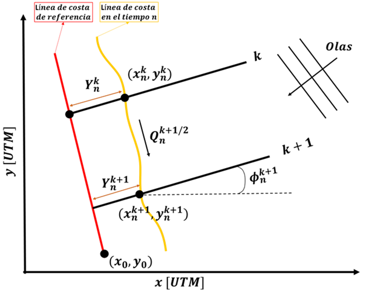

# One-line Models

## GENESIS (Hanson and Kraus, 1989)

The one-line model is a long-term shoreline evolution model that calculates shoreline movements based on longshore sediment transport (LTS) gradients. The model is built with the assumption that the beach profile does not change with time in the long term. The model is suitable for sandy beaches with LST gradients over time.  

The numerical domain is defined by a reference line and transects extending from this line towards the sea. While the transects and reference line are defined by their initial and final coordinates in any metric system, UTM coordinates are preferred to obtain the shoreline response in real-world coordinates. Fig. 2-5-1 presents a sketch of the one-line domain.

**Fig. 2-5-1. Definition sketch of the one-line model proposed by Hanson and Kraus (1989).**

The model’s formulation is:

$$
\frac{∂y}{∂t}+\frac{1}{(h^*+h_{Berm})}(\frac{∂Q}{∂x+q}) = 0
$$

- $y$ : cross-shore shoreline position at a given time [$m$]
- $t$ : time [$s$]
- $Q$ : longshore sediment transport [$m^3 s^{-1}$]
- $x$ : alongshore shoreline position [$m$]
- $q$ : sinks and sources along the coast [$m^2 s^{-1}$]
- $h^*$ : depth of closure [$m$]
- $h_{Berm}$ : berm height [$m$]

The LST is calculated using the CERC (1984) formulation, given by:

$$
Q =\frac{K}{16\sqrt{γ_b}}ρg^{3/2}H_{s,b}^{5/2}sin⁡(2θ_b)
$$

- $K$ : calibration parameter [$ms^{-1}$]
- $γ_b$ : breaker index [$-$]
- $ρ$ : density of water [$kgm^{-3}$]
- $g$ : acceleration due to gravity [$ms^{-2}$]
- $H_{s,b}$: significant wave height at breaking [$m$]
- $θ_b$: wave angle at breaking [$°$]

## CHRONOS (XXXX, XXXX)
