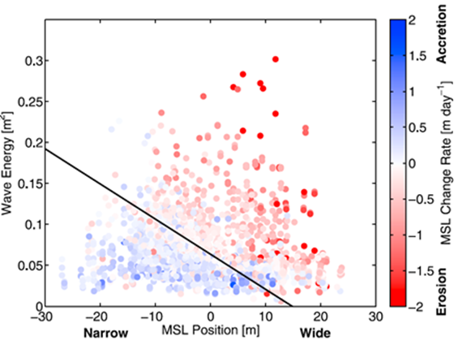
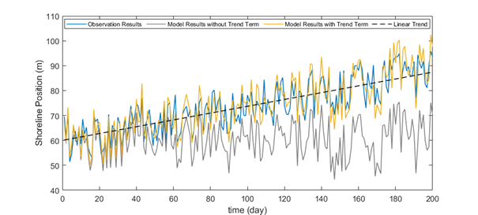

# Equilibrium-based shoreline evolution models (EBSEM) - Cross-shore 

## IHSetMillerDean (Miller and Dean, 2004)

Miller and Dean (2004) proposed a simple model for shoreline evolution using several field datasets. The model is developed based on the observation that shoreline positions change as a function of an equilibrium position. The model includes three adjustable parameters that represent the baseline conditions under which shoreline displacement is calculated to minimize the error. This model is very efficient as it only represents the shoreline response to the process, only requiring the input of readily available storm surge and water level data.

Miller and Dean (2004) suggested a simple shoreline evolution model based on the imbalance of shoreline change between an equilibrium shoreline and shoreline position as follows:

$$
\frac{∂S(t)}{∂t}=k(S_{eq} (t)-S(t))
$$

- $S(t)$ : the shoreline position at time $t$
- $S_{eq}$ : the equilibrium shoreline position
- $k$ : the calibration parameter for the rate at which the shoreline approaches equilibrium ($k; k=k_a H_b^2; k=k_a H_b^3; k=k_a Ω$)

Miller and Dean (2004) proposed an equilibrium shoreline change equation with regards to the change in sea level (Fig. 2-3-1):

$$
S_{eq}=-W^*(t)(\frac{0.068H_b+S}{B+1.28H_b})
$$

- $H_b$ : the breaking wave height
- $S$ : the change in local water level
- $B$ : the berm wave height
- $W^*$ : the width of the active surf zone

**Fig. 2-3-1. Definition sketch of shoreline evolution according the change of water level owing to storm surge and wave setup (Miller and Dean, 2004).**

## IHSetYates (Yates et al., 2009)

For wave-dominated sandy beaches, shoreline position has a large impact on wave energy. Yates et al. (2009) suggested an equilibrium-based shoreline evolution model using hourly estimates of incident wave energy with weekly and monthly survey data on shoreline positions. The model hypothesizes that the mean shoreline change rate depends on the imbalance of wave energy at the mean shoreline position. Using the proposed model, predicted shoreline positions showed a strong correlation at Torrey Pines and two additional survey sites.

Yates et al. (2009) suggested a shoreline evolution model based on the kinetic equation. The governing equation of this kinetic equation is defined as follows:

$$
\frac{∂S(t)}{∂t}=C^±E^{1/2}(E-E_{eq}(S))
$$

- $E$ : the incoming breaking wave energy related to the breaking wave height (water depth at breaking $h_b$ and breaking index γ) as $E=(\frac{H_b}{4.004})^2=(\frac{γ}{4.004})^2 h_b^2$
- $E_{eq}$ : the equilibrium wave energy corresponding to the current shoreline position
- $S(t)$ : the shoreline position at time $t$
- $S_{eq}$ : the equilibrium shoreline position
- $C^±$ : the free parameters where $C^+$ indicates the accretion and $C^-$ indicates the erosion, respectively

Yates et al. (2009) proposed a linear function of the mean shoreline position as presented below:

$$
S_{eq}=\frac{(E-b)}{a}
$$

- $a,b$ : the calibration parameters that satisfy the energy equilibrium function

Fig. 2-3-2 shows wave energy and the mean shoreline change rate according to the mean shoreline position.

**Fig. 2-3-2. Wave energy and mean shoreline change rate according to the mean shoreline position (Yates et al., 2009).**

## IHSetShorefor (Davidson et al., 2013)

Davidson et al. (2013) proposed the development, calibration, and validation of a 1D behaviorally-oriented shoreline evolution model. The model relates cross-shore sediment transport to shoreline displacement, which is the vertical movement of sediment, primarily by incident waves. The potential magnitude of the shoreline position increases with the incident wave power and the degree of imbalance. The proposed model predicting observed shoreline behavior suggests that this approach may be suitable for wider application in coastal engineering.

Davidson et al. (2013) suggested the model for shoreline evolution as follows:

$$
\frac{∂S(t)}{∂t}=b+c^±P^{1/2}(Ω_{eq}(t)-Ω(t))
$$

- $P$ : the incident wave power
- $Ω$ : the time-varying dimensionless fall velocity ($Ω=H/w_sT$)
- $Ω_{eq}$ : the weighted averageof the antecedent dimensionless fall velocity
- $b,c^±$ : the free parameters where $c^+$ indicates the accretion and $c^-$ indicates the erosion, respectively

Davidson et al. (2013) defined the weighted averageof the antecedent dimensionless fall velocity as presented below:

$$
Ω_{eq}=\frac{∑_{j=0}^{D/Δt}Ω_j 10^{-jΔt/ϕ}}{∑_{j=0}^{D/Δt}10^{-jΔt/ϕ}}
$$

- $ϕ$ : the memory decay of the system
- $D$ : the total window width of the weighted average

## IHSetJaramillo (Jaramillo et al., 2020)

Many shoreline evolution models are proposed with the concept of the kinetic equation predicting shoreline position under a constant equilibrium condition. Based on the kinetic equation, Jaramillo et al. (2020) suggested the shoreline evolution model with the addition of a change rate component. This model modified the equation relating equilibrium shoreline position and breaking wave energy to account for the linear trend term. This model showed good overall performance by comparing the shoreline data observed at two sites on the Spanish coast.

Jaramillo et al. (2020) suggested a shoreline evolution model based on this kinetic equation proposed by Yates et al. (2009). The governing equation of the kinetic equation is defined as follows:

$$
\frac{∂S(t)}{∂t}=C^±E^{1/2}(E-E_{eq}(S))
$$

- $E$ : the incoming breaking wave energy related to the breaking wave height (water depth at breaking $h_b$ and breaking index γ) as $E=(\frac{H_b}{4.004})^2=(\frac{γ}{4.004})^2 h_b^2$
- $E_{eq}$ : the equilibrium wave energy corresponding to the current shoreline position
- $S(t)$ : the shoreline position at time $t$
- $S_{eq}$ : the equilibrium shoreline position
- $C^±$ : the free parameters where $C^+$ indicates the accretion and $C^-$ indicates the erosion, respectively

Jaramillo et al. (2020) derived the equilibrium shoreline position by considering the linear trend of the shoreline position as presented below:

$$
S_{eq}=\frac{E-b}{a}+v_{lt}t
$$

- $a,b$ : the parameters that satisfy the energy equilibrium function
- $v_{lt}$ : the linear trend term according to the sediment gain/loss on the littoral zone

Fig. 2-3-3 shows that model predictions with a linear trend term outperform those without the term.

**Fig. 2-3-3. Concept of the shoreline evolution model with the linear trend term proposed by Jaramillo et al. (2020).**

## IHSetLim (Lim et al., 2020)

Lim et al. (2022) analyzed the horizontal behavior of suspended sediment from storms to derive an ordinary differential equation that describes temporal changes in shoreline position. The derived governing equation has a similar mathematical form to the current empirical model. Applying the model to 11 years of wave and shoreline data from Tairua Beach, New Zealand showed that the model has satisfactory field applicability. This study provides a clear theoretical background for the shoreline evolution model and improves the predictive accuracy and generality of the model.

Lim et al. (2022) derived the shoreline evolution model based on the concept of horizontal behavior of suspended sediment as follows:

$$
\frac{∂S(t)}{∂t}=k_r (\frac{E_b}{a_r} -S(t))
$$

- $S(t)$ : the shoreline position at time $t$
- $E_b$ : the incident wave energy
- $k_r,a_r$ : the beach recovery and response factors

In addition, Lim et al. (2022) improved model performance by taking into account the effect of wave setup, as follows:

$$
S_{total}=S+μH_b
$$

- $H_b$ : the breaking wave height
- $μ$ : the free parameter for the effect of wave setup