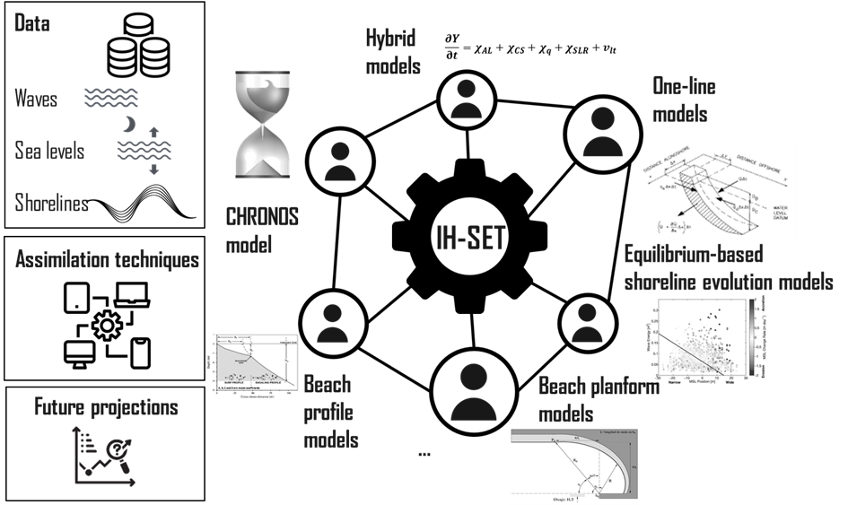
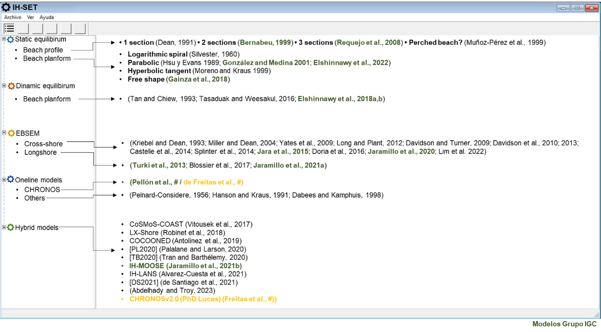

# IH-SET Manual

## Motivation

Coastal zones are dynamic environments, conditioned by agents as diverse as waves, winds, currents, sea level, anthropogenic modifications, as well as other oceanographic and sediment supply factors at different spatio-temporal scales. Therefore, coastal engineering studies or projects vary in nature and complexity. Depending on the scope and objective of each project, managers and actors in the coastal field resort to beach morphodynamics models as useful tools that allow them to estimate the future position of the coastline, to plan and make decisions regarding the protection of infrastructure, services and habitats on the coast.

In general terms, coastal morphodynamics models can be separated into different classifications according to the criteria chosen; by nature, accuracy, scales of application, main direction of the processes involved, among others. For example, depending on the temporal scale of application, there are short-term (hours-days), medium-term (days-years) and long-term (years-decades) models. Depending on the spatial scale, micro-scale (tens of meters), meso-scale (hundreds of meters) and macro-scale (kilometers) models can be distinguished.

Despite the advances made by multiple researchers in recent years, there is still no model capable of analyzing and predicting the evolution of the coast and its processes at different spatial and temporal scales at the same time. Instead, depending on the nature of the project under study, there is a wide range of models available, each of which focuses on a complex problem from a specific point of view.

In the case of short diagnoses or studies, coastal engineers resort to simplified tools such as empirical formulations to define the static and dynamic equilibrium condition, or heuristic models of shoreline position evolution, which are extremely useful to quickly infer morphodynamic processes. On the other hand, in the case of more detailed studies, more robust models that integrate or combine processes are usually used to achieve a more realistic projection of the future condition of the coast. As for the latter, there are 3D models applicable only to the short term due to their computational cost or quasi-3D models also known as hybrids, which assume a series of simplifying hypotheses, in order to be able to predict the changes of the coastline in the medium and long term.

Among the assumptions assumed by existing hybrid models, one usually resorts to wave propagation by linear wave theory (Snell's law), or the assumption of a theoretical beach profile and the consideration that all model calibration parameters remain constant during the forecast simulation. The most drastic simplification they assume, however, is that they do not conserve the overall sediment balance. These models assume sediment conservation in the longitudinal or longshore transport modulus, but not in the integration with movement due to transverse or cross-shore transport. This limitation does not allow a reliable prediction of the future evolution of the coast, resulting in significant uncertainties.

From the above, and considering that the Coastal Engineering and Management Group (IGC) of IHCantabria has devoted years of research focused on the development of new model proposals, which try to address both simplified predictions for short or diagnostic studies, as well as more complex process-based models for more detailed studies; two needs that require to be addressed are inferred:

- The need is identified to develop a system that unifies the morphodynamic models of coastline, some of which have been developed by the IGC Group, allowing the user to choose and execute in an agile way the best methodology according to the scope and objectives of their project. Currently there is no system with these characteristics, so the development of this type of tools would facilitate the application of models in the most diverse fields of coastal engineering, since, to date, these are scattered, in different code formats and available mainly to the academic community.

- The need is identified to devote more research efforts to the development of a model of shoreline evolution integrating cross-shore and longshore processes, guaranteeing sediment conservation. This model is intended to be applicable to the medium, long and very long term, in order to provide more robust, reliable and realistic predictions of changes, as well as an efficiency that allows quantifying the uncertainties associated with the predictions and that is computationally efficient.

Both needs are linked to the initiative that the IGC Group intends to undertake, in the formation of a network of coastal engineering scientists specialized in beach morphodynamics, working on the development of shoreline evolution models. This network seeks interdisciplinary expertise with the objective of improving the understanding of the integrated evolution of shoreline movements taking into account the impacts of climate change and providing a portfolio of validated tools to predict future beach change.

## Outline

This project aims, on the one hand, to develop a tool (IH-SET) that unifies various models of beach morphodynamics, allowing fast and efficient forecasting of future changes of the coastline according to the scope and purpose of the project required by the user, and on the other hand, the development of a new model of coastline evolution by integrating transverse and longitudinal sediment transport processes, preserving sediment balance.

This document outlines succinct technical descriptions of the chosen models, which will be seamlessly integrated into the Shoreline Evolution Tools (IH-SET). These modular tools empower engineers and coastal managers to investigate morphodynamic studies across diverse spatial and temporal ranges, whether it be within a project or while assessing a beach as a physiographic entity.

A schematic infographic is presented in Fig. 1-1, offering an overview of the IH-SET's general structure.


**Fig. 1-1. The general structure of the IH-SET.**

To ensure a unified and comprehensive understanding, each model comes with concise metadata descriptions.
The following figure shows a preliminary list of the models to be included in the IH-SET. The tool will start with the models highlighted in green, which correspond to the expressions developed by the Coastal Management and Engineering Group of IHCantabria.

 
**Fig. 1-2. The general structure of the IH-SET.**

## Contents

### [User manual]([User_manual]/ihset_manual.md)
- [Requirements]([User_manual]/ihset_manual.md)
- [Data preprocessing]([User_manual]/ihset_manual.md)
- [User tutorial]([User_manual]/ihset_manual.md)

### [Model formulation]([Model_description]/ihset_model.md)
- [Static equilibrium (Beach profile)]([Model_description]/equilibrium_profile.md)
- [Static equilibrium (Beach planform)]([Model_description]/equilibrium_planform.md)
- [EBSEM - Cross-shore ]([Model_description]/ebsem_cross.md)
- [EBSEM - Longshore ]([Model_description]/ebsem_long.md)
- [One-line models]([Model_description]/one_line.md)
- [Hybrid models]([Model_description]/hybrid_model.md)

### [Examples]([Examples]/examples.md)
- [Examples]([Examples]/examples.md)
- [Gallaries]([Examples]/examples.md)

### [Installation]([Installation]/installation.md)
- [Installation]([Installation]/installation.md)

## Bibliography

- Davidson, M. A., Splinter, K. D., Turner, I. L., 2013. A simple equilibrium model for predicting shoreline change, Coast. Eng., 73, 191–202. https://doi.org/10.1016/j.coastaleng.2012.11.002
- Dean, R., 1991. Equilibrium beach profiles: characteristics and applications. J. Coast. Res. 7, 53–84. https://www.jstor.org/stable/4297805
- González, M., Medina, R., 2001. On the application of static equilibrium bay formulations to natural and man-made beaches. Coast. Eng. 43, 209–225. https://doi.org/10.1016/S0378-3839(01)00014-X
- Hsu, J.R.C., Evans, C., 1989. Parabolic Bay Shapes and Applications. Proc. Inst. Civ. Eng. 87, 557–570. https://doi.org/10.1680/iicep.1989.3778
- Jara, M.S., González, M., Medina, R., 2015. Shoreline evolution model from a dynamic equilibrium beach profile. Coast. Eng. 99, 1–14. https://doi.org/10.1016/j.coastaleng.2015.02.006
- Jaramillo, C., González, M., Medina, R., Turki, I., 2021a. An equilibrium-based shoreline rotation model. Coast. Eng. 163, 103789. https://doi.org/10.1016/j.coastaleng.2020.103789
- Jaramillo, C., Jara, M.S., González, M., Medina, R., 2021b. A shoreline evolution model for embayed beaches based on cross-shore, planform and rotation equilibrium models. Coast. Eng. 169, 103983. https://doi.org/10.1016/j.coastaleng.2021.103983
- Jaramillo, C., Jara, M.S., González, M., Medina, R., 2020. A shoreline evolution model considering the temporal variability of the beach profile sediment volume (sediment gain / loss). Coast. Eng. 156, 103612. https://doi.org/10.1016/j.coastaleng.2019.103612
- Lim, C., Kim, T. K., Lee, J. L., 2022. Evolution model of shoreline position on sandy, wave-dominated beaches. Geomorphology. 108409. https://doi.org/10.1016/j.geomorph.2022.108409.
- Miller, J. K., Dean, R. G., 2004. A simple new shoreline change model. Coast. Eng. 51, 7, 531–556. https://doi.org/10.1016/j.coastaleng.2004.05.006.
- Turki, I., Medina, R., Coco, G., Gonzalez, M., 2013. An equilibrium model to predict shoreline rotation of pocket beaches. Mar. Geol. 346, 220–232. http://dx.doi.org/10.1016/j.margeo.2013.08.002
- Yates, M.L., Guza, R.T., O’Reilly, W.C., 2009. Equilibrium shoreline response: Observations and modeling. J. Geophys. Res. Ocean. 114, 1–16. https://doi.org/10.1029/2009JC005359

# Contents

```{toctree}
:maxdepth: 2
:caption: Contents:

[Examples]/examples
[Installation]/installation
[Model_description]/ebsem_cross
[Model_description]/ebsem_long
[Model_description]/equilibrium_planform
[Model_description]/equilibrium_profile
[Model_description]/hybrid_model
[Model_description]/ihset_model
[Model_description]/one_line
[User_manual]/ihset_manual